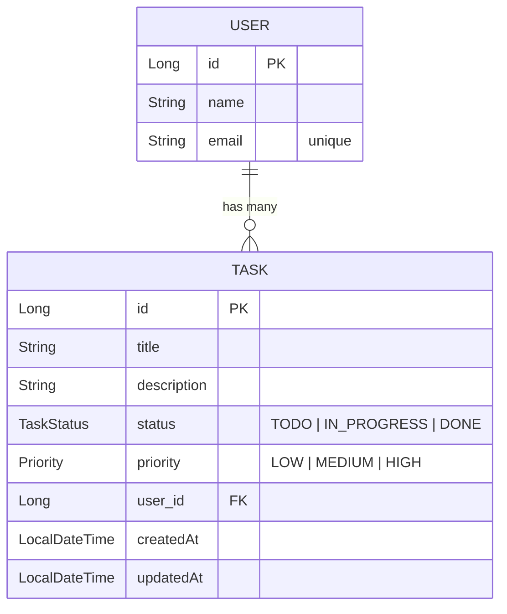
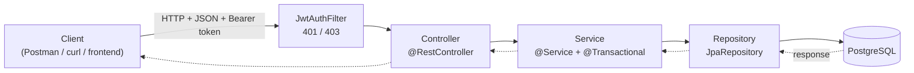
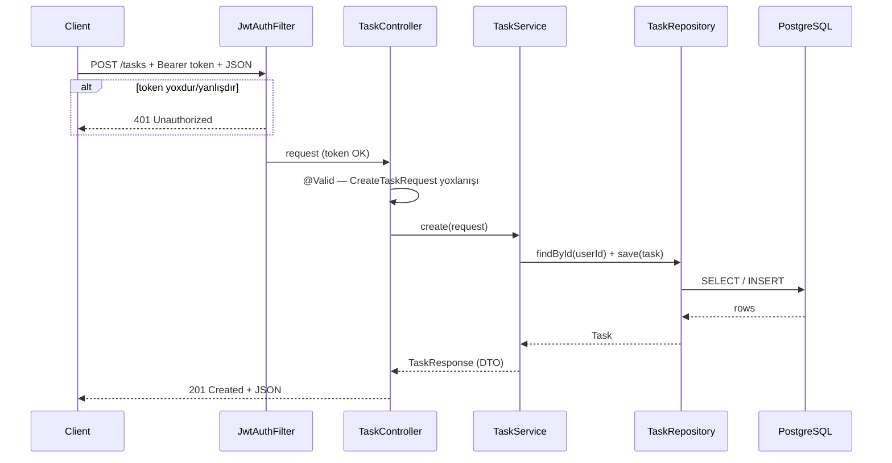
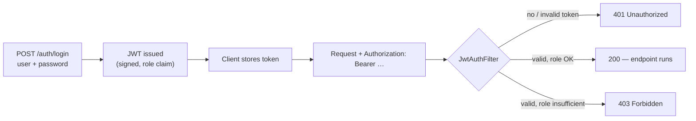

# Architecture / Arxitektura — Task Management API

> Bu sənəd layihənin **məqsədini**, **nə etdiyini** və **ümumi arxitekturasını** izah edir.
> This document explains the project's **purpose**, **what it does**, and its **overall architecture**.
>
> İzahlar Azərbaycanca, texniki terminlər və kod İngiliscədir.

---

## 1. Məqsəd / Purpose

**Task Management API** — istifadəçilərin (User) və onların tapşırıqlarının (Task) idarə olunması üçün
**REST backend** xidmətidir. Layihə *"Backend Development Fundamentals with Java"* təlimi üçün qurulub və
əsas məqsəd — **real backend engineering-i uçtan-uca göstərməkdir**: sadə Java model-dən başlayıb,
production-a yaxın Spring Boot xidmətinə qədər.

Layihə bilərəkdən **fokuslanmış domen** (User + Task) üzərində qurulub ki, diqqət sintaksisə deyil,
**arxitekturaya** yönəlsin: request lifecycle, layer-lər, persistence, validation, testing, security.

**In one sentence:** a small but realistic backend that lets clients create users and manage each user's
tasks over HTTP, backed by a relational database — built layer by layer as a teaching project.

---

## 2. Application tam olaraq nə edir? / What the application does

Xidmət aşağıdakı **əməliyyatları** HTTP üzərindən (JSON) təqdim edir:

- **User idarəetməsi:** yeni user yaratmaq, user-i `id` ilə oxumaq.
- **Task idarəetməsi:** task yaratmaq, bütün task-ları (status üzrə filtr ilə) oxumaq, bir task-ı oxumaq,
  qismən yeniləmək (PATCH) və silmək.
- **Əlaqə:** hər Task bir User-ə aiddir; user-in bütün task-larını oxumaq mümkündür.
- **Authentication:** `/auth/login` token (JWT) qaytarır; qorunan endpoint-lər `Bearer` token tələb edir.

### Endpoints

| Method | Endpoint | Nə edir / What it does | Success | Auth |
|--------|----------|------------------------|---------|------|
| `POST` | `/auth/login` | Login → JWT token | `200` | — |
| `POST` | `/users` | Create a user | `201` | ✓ |
| `GET` | `/users/{id}` | Get a user by id | `200` | ✓ |
| `GET` | `/users/{id}/tasks` | List a user's tasks | `200` | ✓ |
| `POST` | `/tasks` | Create a task | `201` | ✓ |
| `GET` | `/tasks?status=` | List / filter tasks | `200` | ✓ |
| `GET` | `/tasks/{id}` | Get one task | `200` | ✓ |
| `PATCH` | `/tasks/{id}` | Partially update a task | `200` | ✓ |
| `DELETE` | `/tasks/{id}` | Delete a task | `204` | ✓ ADMIN |

> Token olmadan → **401 Unauthorized**. Token var, amma rol çatmır (DELETE) → **403 Forbidden**.

---

## 3. Domain model

Layihənin iki əsas domen obyekti var: **User** və **Task**. Əlaqə: bir User-in çoxlu Task-ı olur
(**one-to-many**).



- **User** — `id`, `name`, `email` (unikal).
- **Task** — `id`, `title`, `description`, `status` (enum), `priority` (enum), aid olduğu `user`,
  və audit sahələri `createdAt` / `updatedAt` (JPA `@PrePersist` / `@PreUpdate` ilə avtomatik dolur).

---

## 4. Ümumi arxitektura / High-level architecture

Layihə **layered (qatlı) architecture** prinsipi üzərində qurulub. Hər qatın bir məsuliyyəti var və
yalnız özündən aşağı qatla danışır.



| Layer | Məsuliyyət / Responsibility | Əsas komponentlər |
|-------|------------------------------|-------------------|
| **Security filter** | Token yoxlanışı, 401/403 | `JwtAuthFilter`, `JwtService`, `SecurityConfig` |
| **Controller** | HTTP, input validation, DTO qaytarır | `UserController`, `TaskController`, `AuthController` |
| **Service** | Business logic, transaction, caching | `UserServiceImpl`, `TaskServiceImpl` |
| **Repository** | Persistence (CRUD + query) | `UserRepository`, `TaskRepository` |
| **Database** | Verilənlərin saxlanması | PostgreSQL (JPA / Hibernate) |

**Əsas ideya:** Controller *HTTP-ni*, Service *qərarı*, Repository *saxlamanı* idarə edir.
DTO-lar sərhəddə (boundary) domain model-i xarici dünyadan ayırır.

---

## 5. Bir request-in yolu / Request lifecycle

Nümunə: **`POST /tasks`** (yeni task yaratmaq).



Xəta ssenariləri (validation, tapılmadı, dublikat) `GlobalExceptionHandler` tərəfindən tutulur və
standart **`ApiError`** formatında qaytarılır.

---

## 6. Paket strukturu / Package structure

```
az.training.taskmanagement
├── TaskManagementApplication      # @SpringBootApplication, @EnableCaching
├── controller/                    # REST layer (@RestController)
│   ├── AuthController
│   ├── UserController
│   └── TaskController
├── service/                       # business logic (interface + impl)
│   ├── UserService / TaskService
│   └── impl/…ServiceImpl
├── repository/                    # Spring Data JPA repositories
│   ├── UserRepository
│   └── TaskRepository
├── model/                         # JPA entities + enums
│   ├── User, Task
│   └── TaskStatus, Priority
├── dto/                           # request/response DTOs + ApiError
├── mapper/                        # entity ⇄ DTO
├── exception/                     # custom exceptions + GlobalExceptionHandler
└── security/                      # JwtService, JwtAuthFilter, SecurityConfig
```

---

## 7. Cross-cutting concerns

- **DTO & mapping** — `CreateTaskRequest`, `TaskResponse` və s. Domain model xaricə "sızmır";
  çevrilmə `UserMapper` / `TaskMapper` ilə edilir.
- **Validation** — Bean Validation (`@NotBlank`, `@Email`, `@NotNull`, `@Size`) + controller-də `@Valid`.
- **Error handling** — `@RestControllerAdvice` (`GlobalExceptionHandler`) bütün xətaları
  `400 / 404 / 409 / 500`-ə map edir və vahid `ApiError` body qaytarır.
- **Logging** — SLF4J; əməliyyatlar və xətalar strukturlu şəkildə log-lanır.
- **Caching** — `@Cacheable` / `@CacheEvict` (task oxunuşları); hazırda in-memory, production-da Redis.
- **Transactions** — service metodlarında `@Transactional` (all-or-nothing).
- **Security** — bax: bölmə 9.

### Standard error model (`ApiError`)

```json
{
  "timestamp": "2026-09-13T10:00:00",
  "status": 404,
  "error": "Not Found",
  "message": "Task tapılmadı: id=99",
  "path": "/tasks/99",
  "fieldErrors": null
}
```

---

## 8. Texnologiya stack-i / Tech stack

| Sahə | Texnologiya |
|------|-------------|
| Language | Java 21 |
| Framework | Spring Boot 3.3 (Web) |
| Persistence | Spring Data JPA / Hibernate |
| Database | PostgreSQL |
| Validation | Jakarta Bean Validation |
| Security | JWT (jjwt) — introductory, filter-based |
| Caching | Spring Cache (in-memory) |
| Testing | JUnit 5, Mockito, MockMvc |
| Build | Maven |
| Delivery | Docker, docker-compose, GitHub Actions (CI) |

---

## 9. Security modeli / Security model

Introductory səviyyə: token-based authentication (JWT). Production-da bu iş **Spring Security** ilə görülür.



- **Authentication** = *kimsən?* → login + JWT.
- **Authorization** = *nəyə icazən var?* → rol (`role` claim); məs. `DELETE` yalnız `ADMIN`.
- **401 vs 403** — 401: kimlik yoxdur/yanlış; 403: kimlik var, icazə yox.
- Server **stateless** qalır — identity token-in içindədir.

---

## 10. Build, run & deploy

```bash
# 1) Verilənlər bazasını qaldır (local)
docker compose up -d postgres

# 2) Application-ı işə sal
mvn spring-boot:run          # http://localhost:8080

# və ya hər şey konteynerdə
docker compose up --build

# Testlər
mvn test
```

- **Dockerfile** — çox-mərhələli build (Maven build → JRE runtime).
- **docker-compose.yml** — `app` + `postgres` (healthcheck ilə).
- **GitHub Actions** — hər push/PR-də `mvn -B verify` (build + test).

---

## 11. Arxitektura dərs-dərs necə quruldu / How the architecture was built up

Layihə təlim boyunca **cumulative** şəkildə, hər dərsdə bir qat əlavə olunaraq quruldu:

| Layer / concern | Dərs |
|-----------------|------|
| Domain model + in-memory | Lesson 1 |
| Layered architecture, DTO, mappers | Lesson 2 |
| Interfaces + dependency injection (SOLID) | Lesson 3 |
| REST contract (OpenAPI) | Lesson 4 |
| Spring Boot + first endpoints | Lesson 5 |
| Full REST API | Lesson 6 |
| Relational DB + SQL | Lesson 7 |
| JPA / Hibernate persistence | Lesson 8 |
| Bean Validation | Lesson 9 |
| Exception handling + logging | Lesson 10 |
| Tests (JUnit + Mockito + MockMvc) | Lesson 11 |
| Security (JWT), caching, Docker, CI/CD | Lesson 12 |

> Ətraflı: kök [`README.md`](README.md) və hər branch-dəki `LESSON.md`.
