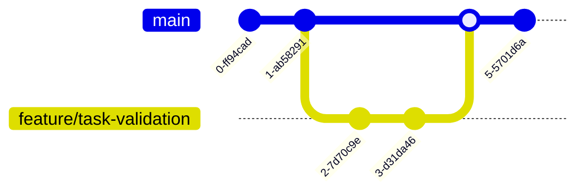

# Git və GitHub: junior üçün ilk addımlar

Layihəni kompüterinə endirməkdən Pull Request açmağa qədər gündəlik iş axını. Hər addımda nə etdiyini və niyə etdiyini göstəririk.



`main` branch hamının istifadə etdiyi sabit koddur. Sənin branch-in isə rahat işlədiyin ayrıca xəttdir: iş hazır olanda onu Pull Request ilə `main`-ə qaytarırsan.

---

## Əvvəlcə beş anlayış

| Anlayış | Mənası |
|---|---|
| **Repository (repo)** | Layihənin bütün faylları və onların dəyişiklik tarixçəsi. |
| **Commit** | Dəyişikliklərin “şəkli”: nə dəyişdi, kim dəyişdi, niyə dəyişdi. |
| **Branch** | Əsas koda toxunmadan paralel işləmək üçün ayrıca xətt. |
| **Remote / origin** | Repo-nun GitHub-dakı nüsxəsi. `origin` onun standart adıdır. |
| **Pull Request (PR)** | “Mənim branch-imi main-ə birləşdirin” sorğusu. Review burada olur. |

Git-in üç sahəsi:

```
Working directory  --git add-->  Staging area  --git commit-->  Local repo  --git push-->  GitHub
(faylı redaktə edirsən)         (commit-ə hazırlanır)          (tarixçədə saxlanır)
```

---

## 0. Git-i qur və özünü tanıt *(bir dəfəlik)*

Git-i [git-scm.com](https://git-scm.com/downloads) saytından yüklə. Sonra terminalda adını və GitHub e-poçtunu yaz: bu məlumat hər commit-in üstündə görünəcək.

```bash
git --version
git config --global user.name "Ad Soyad"
git config --global user.email "sen@example.com"
git config --global init.defaultBranch main
```

> **Diqqət:** GitHub terminalda adi şifrəni qəbul etmir. Push zamanı şifrə soruşulanda ya *Personal Access Token* yaz (GitHub → Settings → Developer settings → Tokens), ya da SSH açarı qur. IntelliJ IDEA-da GitHub hesabına daxil olmaq da bu problemi həll edir.

## 1. Layihəni clone et

Clone repo-nun tam nüsxəsini (bütün tarixçə və branch-lərlə birlikdə) kompüterinə endirir. Bunu hər layihə üçün bir dəfə edirsən.

```bash
git clone https://github.com/Naghiyev/backend-session.git
cd backend-session
git status
```

Link-i GitHub-da yaşıl **Code** düyməsindən götürə bilərsən. IntelliJ-də eyni işi *File → New → Project from Version Control* ilə edirsən.

## 2. Mövcud branch-lərə bax

Təlimdə hər dərsin kodu ayrıca branch-dədir. Hansı branch-lərin olduğuna baxıb istədiyinə keç:

```bash
git fetch                 # GitHub-dakı yenilikləri çək (koda toxunmur)
git branch -a             # lokal + remote branch-lər
git switch branch_lesson1
git branch                # * işarəsi hazırda olduğun branch-dir
```

`git switch` yeni əmrdir; köhnə məqalələrdə eyni iş üçün `git checkout` görəcəksən.

## 3. Öz branch-ini yarat

Heç vaxt birbaşa `main`-də işləmə. Hər tapşırıq üçün yeni branch aç: səhv etsən, əsas koda heç nə olmur.

```bash
git switch main
git pull                                  # əvvəlcə main-i yenilə
git switch -c feature/task-validation     # yarat və keç
```

**Branch adları:** qısa, kiçik hərflə, sözlər tire ilə: `feature/user-registration`, `bugfix/task-status-null`, `homework/lesson3-aydan`. Addan branch-in nə üçün olduğu dərhal anlaşılmalıdır.

## 4. Dəyiş, yoxla, commit et

Kod yaz, sonra nəyi dəyişdiyinə bax və yalnız lazım olan faylları commit-ə əlavə et.

```bash
git status                           # hansı fayllar dəyişib
git diff                             # dəqiq nə dəyişib
git add src/main/java/.../TaskService.java
git add .                            # və ya hamısını (əvvəl status-a bax!)
git commit -m "Add validation for empty task title"
```

**Yaxşı commit mesajı:** bir commit bir məntiqi dəyişiklikdir. Mesaj nə etdiyini deyir: `Add due date to Task entity` yaxşıdır, `fix`, `update`, `asdf` isə yox. Kiçik və tez-tez commit etmək böyük bir commit-dən həmişə yaxşıdır.

## 5. GitHub-a push et

Commit-lər hələ yalnız sənin kompüterindədir. Push onları GitHub-a göndərir. İlk push-da `-u` lokal branch-i remote ilə əlaqələndirir; sonrakı dəfələr sadəcə `git push` kifayətdir.

```bash
git push -u origin feature/task-validation
git push                             # sonrakı dəfələr
```

> **Repo-ya yazma icazən yoxdursa:** push “permission denied” xətası verəcək. O zaman GitHub-da repo-nu *Fork* et, öz fork-unu clone et və PR-ı fork-dan orijinal repo-ya aç.

## 6. Pull Request aç

Push-dan sonra GitHub-da repo səhifəsinə gir: sarı zolaqda **Compare & pull request** düyməsi çıxacaq.

- **Base** branch-in düzgün olduğunu yoxla (adətən `main`).
- Başlığa nə etdiyini yaz; təsvirdə nəyi və niyə dəyişdiyini, necə test etdiyini qısa izah et.
- Sağ tərəfdən reviewer seç.

Review-da şərh gəlsə, eyni branch-də düzəliş et, commit və push et: PR avtomatik yenilənir, yenisini açmağa ehtiyac yoxdur.

## 7. Branch-ini yenilə və conflict-i həll et

Sən işləyərkən başqaları `main`-ə dəyişiklik göndərə bilər. PR-ı açmazdan əvvəl ən son `main`-i öz branch-inə gətir:

```bash
git fetch origin
git merge origin/main
```

Eyni sətri iki nəfər dəyişibsə, Git *conflict* verir və faylda belə işarələr qoyur:

```
<<<<<<< HEAD
    return taskRepository.findAll();
=======
    return taskRepository.findAllByUserId(userId);
>>>>>>> origin/main
```

Düzgün variantı saxla, işarələri sil, sonra:

```bash
git add TaskService.java
git commit
git push
```

IntelliJ-in *Resolve conflicts* pəncərəsi bunu üç sütunda vizual göstərir və başlanğıc üçün daha rahatdır.

---

## Səhv etdim, nə edim?

| Vəziyyət | Əmr |
|---|---|
| Fayldakı dəyişikliyi ləğv etmək (hələ add etməmisən) | `git restore Fayl.java` |
| Faylı staging-dən çıxarmaq (add etmisən, commit yox) | `git restore --staged Fayl.java` |
| Son commit-in mesajını düzəltmək (hələ push etməmisən) | `git commit --amend -m "Yeni mesaj"` |
| Son commit-i geri almaq, dəyişikliklər qalsın | `git reset --soft HEAD~1` |
| Yarımçıq işi kənara qoyub başqa branch-ə keçmək | `git stash`, sonra `git stash pop` |
| Hansı branch-də olduğunu yoxlamaq | `git branch` və ya `git status` |
| Tarixçəyə baxmaq | `git log --oneline --graph` |

> **Qızıl qayda:** artıq push etdiyin commit-ləri `reset`, `amend` və ya `push --force` ilə dəyişmə, xüsusən `main`-də. Başqalarının işini pozursan. Push olunmuş səhvi `git revert <commit>` ilə yeni commit kimi geri al.

## Nəyi commit etməmək lazımdır

Build nəticələri, IDE parametrləri və şifrələr repo-ya düşməməlidir. Layihənin kökündə `.gitignore` faylı bunu təmin edir. Java/Maven layihəsi üçün minimal nümunə:

```gitignore
target/
build/
.idea/
*.iml
.DS_Store
*.log
.env
application-local.yml
```

> **Heç vaxt:** DB şifrəsini, API açarını və ya token-i commit etmə. Təsadüfən push etsən, faylı silmək kifayət deyil (tarixçədə qalır): həmin şifrəni dərhal dəyiş.

## Gündəlik iş axını, bir baxışda

```bash
git switch main && git pull
git switch -c feature/qisa-ad
# ... kod yaz ...
git status && git diff
git add . && git commit -m "Nə etdiyini yaz"
git push -u origin feature/qisa-ad
# GitHub-da Pull Request aç → review → merge
```
